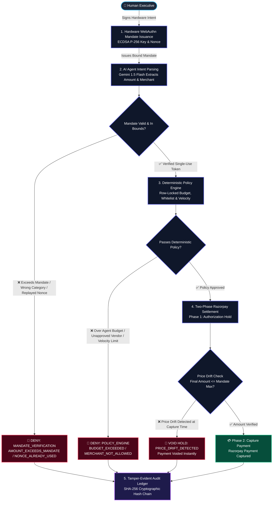
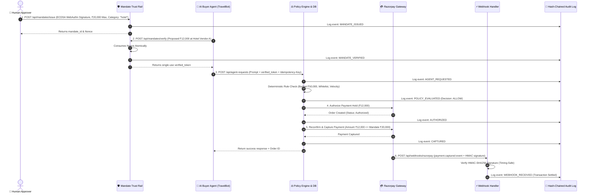
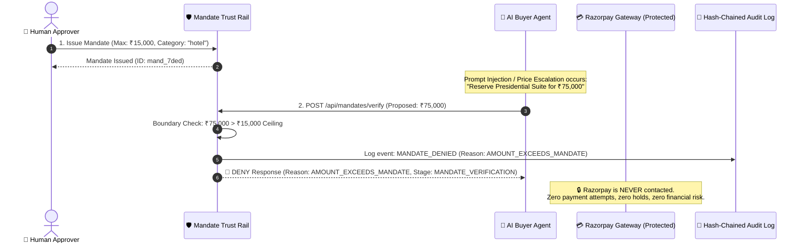

# AgentPay OS — System Architecture & Security Report

---

## 1. Executive Summary: What AgentPay OS Does & Why It Exists

Autonomous AI agents are increasingly tasked with real-world procurement—booking flights, reserving hotels, and purchasing software licenses. However, granting an AI direct access to credit cards or banking APIs introduces critical vulnerabilities: LLMs can hallucinate prices, fall prey to prompt injection attacks, execute duplicate transactions during network retries, or exceed departmental budgets. 

**AgentPay OS** solves this fundamental trust gap by establishing a **deterministic financial firewall and cryptographic trust rail** between AI agents and real payment gateways (such as Razorpay). Before an agent can spend a single rupee, a human signs a chardware-backed WebAuthn mandate defining strict upper bounds (max amount, vendor category, and validity window). The AI agent’s natural language intent is then validated by a 100% deterministic Policy Engine with zero AI dependencies, executed via a two-phase payment hold (Authorize $\rightarrow$ Reconfirm $\rightarrow$ Capture), and permanently anchored into a tamper-evident, SHA-256 hash-chained audit ledger. If an agent tries to overspend, hallucinate, or replay a request, the system blocks the transaction at the firewall before the payment rail is ever touched.

---

## 2. High-Level Architecture (5-Stage Firewall & Payment Pipeline)

The following diagram illustrates the 5 sequential stages of AgentPay OS. Transactions follow the green **ALLOW** path only when all cryptographic, policy, and price-drift checks succeed. Any violation immediately triggers a **DENY** branch and safely aborts without contacting Razorpay.

---

## 3. End-to-End Success Sequence (Happy Path)

This sequence diagram depicts a complete successful purchasing lifecycle (e.g., booking a hotel room for ₹12,000 under a ₹20,000 mandate), showing the exact event names recorded in the cryptographic audit log.

---

## 4. Graceful Failure Handling: Mandate Ceiling Defense

This sequence shows what happens when an AI agent attempts a purchase that exceeds its authorized mandate limit (e.g., attempting a ₹75,000 luxury suite purchase under a ₹15,000 mandate). **The request is rejected at the Trust Rail, and the financial gateway (Razorpay) is never invoked.**

---

## 5. Security Guarantees & Enforcement Mechanisms

The table below maps each core security guarantee to the exact code mechanism that enforces it in the repository:

| Security Guarantee | Threat Model Addressed | Enforcement Code Mechanism | Location in Codebase |
| :--- | :--- | :--- | :--- |
| **Human-in-the-Loop Authority** | AI agents executing unapproved or out-of-scope transactions. | **WebAuthn ECDSA P-256** hardware-bound signatures validated via `@simplewebauthn/server`. | [`mandateService.js`](file:///c:/Users/DARSHAN%20PRAJAPATHI/Desktop/AgentPay-Os/backend/src/services/mandateService.js) |
| **Single-Use Mandates & Nonce Protection** | Replay attacks re-using old approvals or racing identical tokens. | **Atomic Nonce Consumption** using database-level row locks (`SELECT ... FOR UPDATE`). | [`mandateService.js`](file:///c:/Users/DARSHAN%20PRAJAPATHI/Desktop/AgentPay-Os/backend/src/services/mandateService.js) |
| **Deterministic Spend Caps** | AI agents hallucinating permissions or exceeding budgets. | **100% Deterministic Policy Engine** with atomic budget deductions; zero LLM decision rights. | [`policyEngine.js`](file:///c:/Users/DARSHAN%20PRAJAPATHI/Desktop/AgentPay-Os/backend/src/services/policyEngine.js) & [`supabaseClient.js`](file:///c:/Users/DARSHAN%20PRAJAPATHI/Desktop/AgentPay-Os/backend/src/db/supabaseClient.js) |
| **Merchant Whitelisting** | Agents buying from unapproved or fraudulent vendor websites. | Case-insensitive array whitelist check on agent profile prior to order creation. | [`policyEngine.js`](file:///c:/Users/DARSHAN%20PRAJAPATHI/Desktop/AgentPay-Os/backend/src/services/policyEngine.js) |
| **Velocity Limiting** | Runaway autonomous loops executing hundreds of micropayments. | Rolling 1-hour transaction volume counter with hard limit enforcement (default: 5 tx/hr). | [`policyEngine.js`](file:///c:/Users/DARSHAN%20PRAJAPATHI/Desktop/AgentPay-Os/backend/src/services/policyEngine.js) |
| **Idempotency & Replay Locks** | Network timeouts causing double-charging or dual-order placement. | Distributed idempotency key checks caching active/completed transaction state. | [`idempotencyService.js`](file:///c:/Users/DARSHAN%20PRAJAPATHI/Desktop/AgentPay-Os/backend/src/services/idempotencyService.js) |
| **Time-of-Check to Time-of-Use (TOCTOU) Protection** | Vendors changing prices between order authorization and final capture. | **Two-Phase Commit**: `authorizeOrder()` $\rightarrow$ `reconfirmAmount()` $\rightarrow$ `captureOrder()` or `voidAuthorization()`. | [`razorpayService.js`](file:///c:/Users/DARSHAN%20PRAJAPATHI/Desktop/AgentPay-Os/backend/src/services/razorpayService.js) |
| **Tamper-Evident Auditability** | Database administrators or attackers modifying transaction logs. | **Cryptographic SHA-256 Hash Chaining**: $H_i = \text{SHA256}(H_{i-1} + \text{canonicalJSON}(E_i))$. | [`supabaseClient.js`](file:///c:/Users/DARSHAN%20PRAJAPATHI/Desktop/AgentPay-Os/backend/src/db/supabaseClient.js) |
| **Webhook Spoofing Defense** | Malicious third-parties sending fake payment success confirmations. | **HMAC-SHA256** constant-time signature verification with `crypto.timingSafeEqual`. | [`razorpayService.js`](file:///c:/Users/DARSHAN%20PRAJAPATHI/Desktop/AgentPay-Os/backend/src/services/razorpayService.js) |

---

## 6. Proof It Works: Test Coverage & 5-Act Demonstration

### Automated Test Suite
- **54 of 54 Automated Tests Passing (100% Pass Rate)**
- Test Suites Covered:
  1. Mandate Issuance & Hardware WebAuthn Cryptographic Verification (P-256 ES256)
  2. Mandate Bounds & Scope Verification Service
  3. Atomic Nonce Replay & High-Concurrency Race Condition Protection
  4. Deterministic Policy Engine Rule Validation & Structured Denials
  5. Row-Level Locking & Concurrent Budget Deductions
  6. Two-Phase Authorization / Capture & TOCTOU Price-Drift Voiding
  7. Idempotency Key Caching & HMAC Webhook Verification
  8. Cryptographic Hash-Chain Ledger Integrity & Tamper Detection
  9. Gemini Natural Language Intent Parsing & Injection Defense

### 5-Act Live Simulation (`simulateBuyer.js`)
All five core demo scenarios are verified end-to-end against live **Supabase PostgreSQL**, **Google Gemini 1.5 Flash**, and **Razorpay**:

1. **Act 1 (Happy Path)**: Autonomous request for ₹12,000 hotel room within ₹20,000 mandate and ₹50,000 budget $\rightarrow$ **ALLOWED**, Razorpay order authorized and captured, webhook verified $\rightarrow$ **PASS ✅**
2. **Act 2 (Blocked Budget)**: Urgent luxury suite request for ₹75,000 exceeding agent budget of ₹50,000 $\rightarrow$ **DENIED** with code `BUDGET_EXCEEDED` before Razorpay is called $\rightarrow$ **PASS ✅**
3. **Act 3 (Duplicate / Race Condition)**: Two requests fired concurrently with the same `Idempotency-Key` $\rightarrow$ First request approved, second request intercepted and blocked with code `DUPLICATE_BLOCKED` $\rightarrow$ **PASS ✅**
4. **Act 4 (Prompt Injection Defense)**: Adversarial prompt attempting to override mandate limits $\rightarrow$ Trust Rail catches violation and denies with code `AMOUNT_EXCEEDS_MANDATE` $\rightarrow$ **PASS ✅**
5. **Act 5 (Nonce Replay Attack)**: Attacker attempts to reuse an already-consumed mandate nonce $\rightarrow$ Trust Rail denies atomically with code `NONCE_ALREADY_USED` $\rightarrow$ **PASS ✅**
